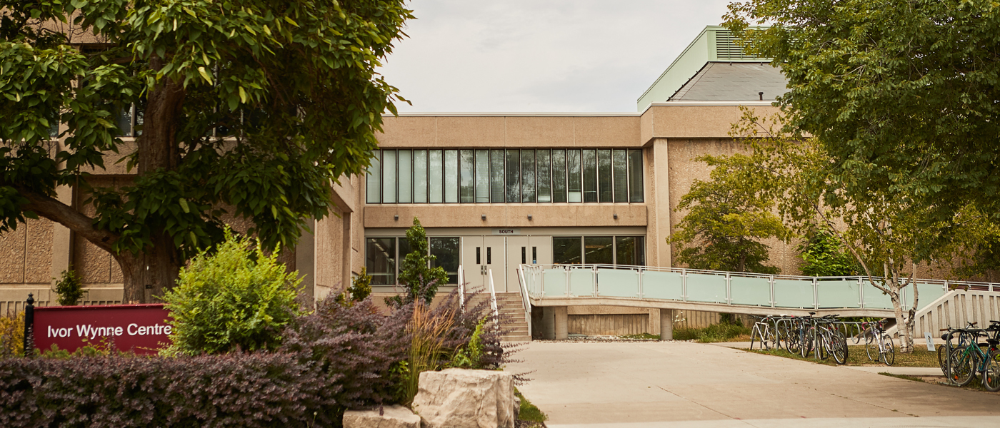

The **Movement and Cognition Lab** is an interdisciplinary research team interested in how the human brain controls and learns skilled actions in healthy and clinical populations. We also conduct metascience research to gain insights into research practices within kinesiology and related areas. The lab is located in the Ivor Wynne Centre, which is home to the [Department of Kinesiology](https://www.science.mcmaster.ca/kinesiology/){target="_blank"} within the [Faculty of Science](https://www.science.mcmaster.ca/){target="_blank"} at [McMaster University](https://www.mcmaster.ca/){target="_blank"}.

#### Recent lab news ---------

[July 23 2026]. **New paper.** Calalo JA, Sullivan SR, Muscara NR, Buggeln JH, Ngo TT, Short MR, Carter MJ, Kurtzer IL, & Cashaback JGA. Deliberation is a controllable process governed by desirability and cognitive effort. *Journal of Neurophysiology*.

[July 21 2026]. **New paper.** Buggeln JH, Muscara NR, Sullivan SR, Calalo JA, Ngo TT, Short MR, Roth AM, Carter MJ, & Cashaback JGA. Successful reinforcement history suppresses explicit and implicit error corrections. *PLoS Computational Biology*.

[June 8 2026]. **Milestone.** Congratulations to Michael Croteau who has successfully defended his Transfer to PhD talk. We are excited that Michael is continuing his graduate work in the lab.

[April 29 2026]. **Funding.** Our NSERC Discovery Grant has been renewed until 2031.
