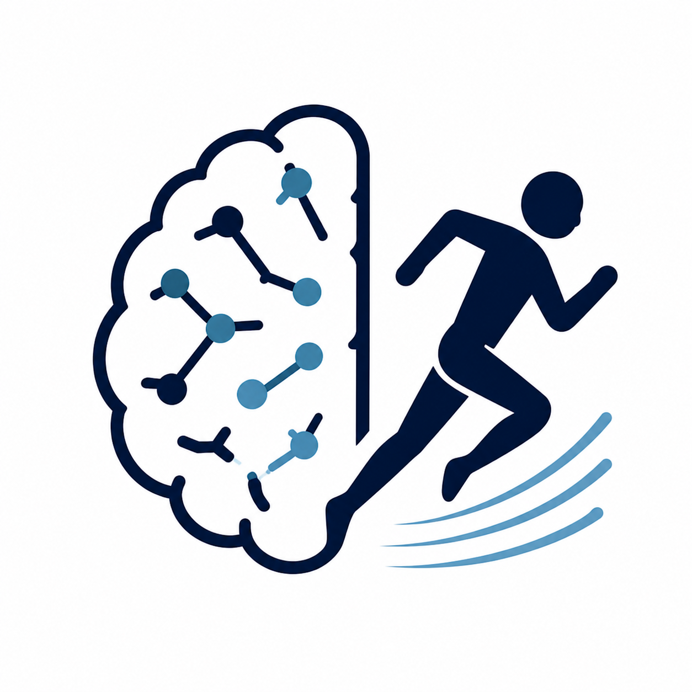

  
  

  <!-- <h4> [Motor Control and Learning](https://carterjmike.github.io/kinesiol-2mc3/) </h4> -->
  <h4> Motor Control and Learning </h4>
  
 KINESIOL 2MC3 

  
 Coming soon... 

  

  
  

  <!-- <h4> [Motor Control and Learning](https://carterjmike.github.io/kinesiol-2mc3/) </h4> -->
  <h4> Movement Neuroscience </h4>
  
 KINESIOL 4TT3 

  
 Coming soon... 

  

  
  

  <!-- <h4> [Motor Control and Learning](https://carterjmike.github.io/kinesiol-2mc3/) </h4> -->
  <h4> Scientific Computing for Reproducible Science </h4>
  
 KINESIOL 736 

  
 Coming soon... 

  

